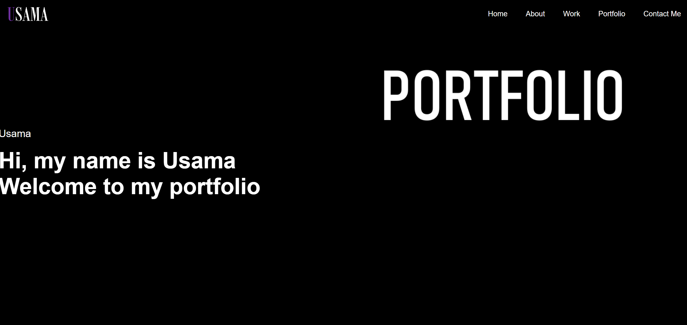

# Usama's Portfolio

## Table of Contents

- Description
- Link
- User Story
- Deployed link

## Description

This is my personal portfolio website which showcases my projects and skills. 
This project provides an overview of who I am, my work, and a way to contact me. I have put in a few pictures from my previous project and a avatar. 
This week i had to start the code from the scratch and created a web using HTML and CSS. this was a challenge as i had to use advanced CSS to bring my website
to life

## Link

You can view the webiste by the following link:  
file:///C:/Users/uabdu/OneDrive/Desktop/Week-2-Advanced-CSS-Usama/index.html

## User Story 

The employer will view my portfolio and see the project i worked on. 
They can review sample and assess if i am a good candidate for the position. 

# Deployed Link

https://usamaali0909.github.io/Week-2-Advanced-CSS-Usama/

